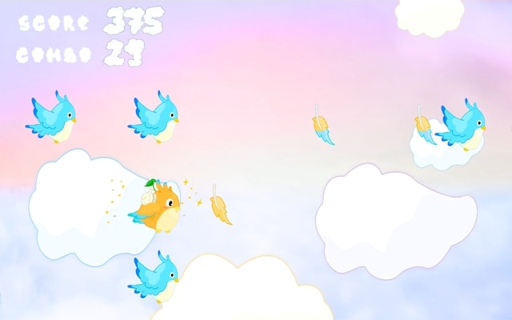

# 小菜鸡 Go · Fledgling Go

「在头鸟的引领下与周围的鸟群一同在云层间起舞」—— 受《节奏天国》启发的节奏类小游戏。

[**可执行程序**](https://github.com/ayuusweetfish/Fledgling-Go/releases) | [**录像**](https://ayu.land/fledgling/Fledgling_Go_RPi.mp4)

课程作业小组成员 @kuriko1023 @Starrah @ayuusweetfish

游戏音轨：[**Stray Toy's Adventure!!**](https://soundcloud.com/umecha24909/stray-toys-adventure) by 梅干茶漬け

## 技术细节

游戏程序逻辑由 ARMv6 汇编语言编写，运行在一个自主设计的单任务操作系统环境“kayubox”中。kayubox 程序可以通过一组系统调用来访问图像、声音、按键等功能，在树莓派（Raspberry Pi Zero）单片机上运行，也可以在桌面计算机上使用模拟器调试。借助 [Circle](https://github.com/rsta2/circle) 库，树莓派版本可以直接运行在裸机上，不依托复杂的桌面操作系统，且可以直接在 SD 存储卡上替换游戏程序。

kayubox 的系统调用文档位于 `doc/syscalls.txt`。其在树莓派上的实现暂时留给读者作为练习。

## 构建

构建步骤在 Unix-like 环境下完成。
- kayubox: 在 `kayubox/emu` 目录中执行 `make libs; make` 即可。
  - 若要交叉编译 Windows 版本，安装 MinGW-w64（`x86_64-w64-mingw32-gcc`）工具链后执行 `make CROSS_WIN=1`。
- 游戏本体：安装 Arm GNU Toolchain 后，在 `src` 目录中执行 `make`。

## 许可

程序源码按照 [GPLv3](https://www.gnu.org/licenses/gpl-3.0.html) 分发，美术、声音等资源按照 [CC BY-NC-SA International 4.0](https://creativecommons.org/licenses/by-nc-sa/4.0/) 许可分发。

# [en] Fledgling Go

“Following the leading bird, dance with the flock among the clouds” — a rhythm game inspired by *Rhythm Heaven*.

[**Executable**](https://github.com/ayuusweetfish/Fledgling-Go/releases) | [**Video**](https://ayu.land/fledgling/Fledgling_Go_RPi.mp4)

Course project members: @kuriko1023 @Starrah @ayuusweetfish

Track in the game: [**Stray Toy's Adventure!!**](https://soundcloud.com/umecha24909/stray-toys-adventure) by 梅干茶漬け

## Technical Details

The game logic is written in ARMv6 assembly and runs in a custom single-tasking OS environment named **kayubox**. kayubox programs access functionalities such as video/audio output and button presses through a set of system calls. They can run on the Raspberry Pi Zero single board computer or be debugged on desktop computers with an emulator. With the [Circle](https://github.com/rsta2/circle) library, the Raspberry Pi version runs directly on bare metal without depending on a complex desktop OS, and games can be swapped by simply copying files on the SD card.

Documentation for kayubox system calls is at `doc/syscalls.txt`. For now, we leave the implementation of the kayubox environment on Raspberry Pi to the reader as an exercise.

## Building

The building steps are carried out under a Unix-like environment.
- kayubox: Under the `kayubox/emu` directory, run `make libs; make`.
  - To cross-compile the Windows version, install the MinGW-w64 (`x86_64-w64-mingw32-gcc`) toolchain and run `make CROSS_WIN=1`.
- The game: With Arm GNU Toolchain installed, run `make` under the `src` directory.

## Licenses

The program sources are distributed under [GPLv3](https://www.gnu.org/licenses/gpl-3.0.html). Assets including artwork, sounds, etc. are distributed under [CC BY-NC-SA International 4.0](https://creativecommons.org/licenses/by-nc-sa/4.0/).
